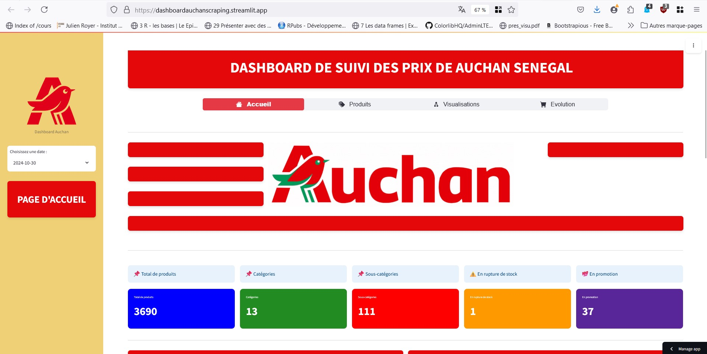
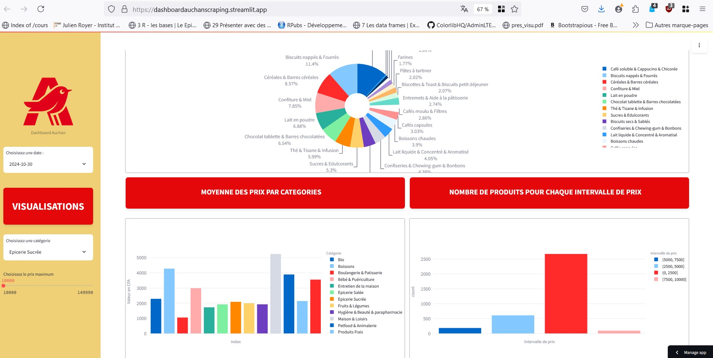

# AuchanScraping

[](https://dashboardauchanscraping.streamlit.app/)

Lien vers l'application [dashboardauchanscraping.streamlit.app](https://dashboardauchanscraping.streamlit.app/)

**AuchanScraping** est un projet réalisé en groupe dans le cadre de notre formation en Big Data et Cloud Computing à l'**ENSAE de Dakar** au premier semestre d'ISE2. L'objectif du projet est de scraper les données du site Auchan Sénégal, puis de les visualiser dans un tableau de bord interactif construit avec Streamlit.

## Structure du Projet

Le projet est organisé en deux parties principales :

1. **ScrapyWorkspace** : Ce dossier contient le code pour scraper le site Auchan Sénégal à l'aide de Scrapy.
2. **AppStreamlit** : Ce dossier contient l'application Streamlit, qui génère le tableau de bord interactif à partir des données scrappées.

Nous avons initialement travaillé sur deux répertoires GitHub distincts : un pour le scraping et un pour le tableau de bord. La version finale du projet est fusionnée dans la branche `main`.

Le fichier webSite_structure.md constitue le fruit d'une analyse minitieuse de la structure et des convention adopte par le site Auchan SN.


## Aperçu de l'Application

Un aperçu de l'interface de notre dashboard.



## Installation et Configuration

1. Clonez le dépôt et placez-vous dans le dossier AuchanScraping via un terminal :
   ```bash
   git clone https://github.com/Mafieuu/AuchanScraping
   cd AuchanScraping
   ```

2. Créez un environnement virtuel et activez-le :
   ```bash
   python -m venv venv
   source venv\bin\activate    # Sur MacOS/Linux
   source venv/Scripts/activate       # Sur Windows
   ```

3. Installez les dépendances :
   ```bash
   pip install -r requirements.txt
   ```

## Exécution du Projet

### Exécution du Tableau de Bord Streamlit

Pour démarrer l'application Streamlit, accédez au dossier `AppStreamlit` et lancez :
```bash
streamlit run app.py
```
Cela ouvrira l'interface Streamlit dans votre navigateur.

### Exécution du Scraping

Depuis le dossier `ScrapyWorkspace`, lancez le scraping en exécutant la commande suivante :
```bash
scrapy crawl auchan
```
Le scraping récupérera les données d'Auchan Sénégal et les enregistrera dans notre base de données AWS.

## Guide d'Utilisation de l'Application

Une vidéo YouTube sera mise à disposition dans les heures qui suivent pour guider les utilisateurs lambda dans la prise en main de l’application.

## Auteurs

Ce projet a été réalisé en *deux semaines* par :
- Ndeye Fama Diop
- Maty Dione
- Famara Sadio
- Larry Sandjo
- Moussa Dieme

---

**Suggestions et Remarques**

Nous sommes ouverts à toutes les suggestions et remarques qui pourraient améliorer ce projet. N'hésitez pas à partager vos idées, retours ou signaler des problèmes en ouvrant une *issue* sur ce dépôt. Nous ferons de notre mieux pour y répondre rapidement et intégrer vos retours. Merci.